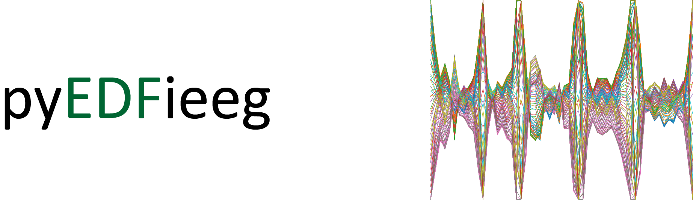

# Useful functions for navigating unstructured folders of EDF files, gathering useful information and extracting specified segments of data.


[](https://github.com/Mariellapanag/pyEDFieeg/blob/main/LICENSE)

## Installation

The ```pip``` tool can be used to download the package

```bash
$ pip install git+https://github.com/Mariellapanag/pyEDFieeg.git
```
or

```bash
$ git clone https://github.com/Mariellapanag/pyEDFieeg.git
```
then the whole repository is being downloaded. The library root is located in the ```.\src``` folder.

## Documentation

The documentation can be found here [Sphinx documentation] ()


## License

Released under the MIT license.


